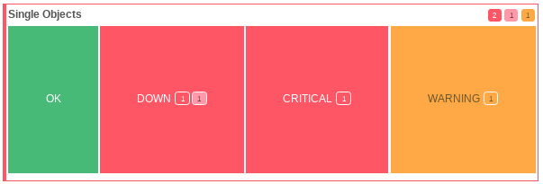
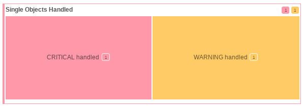

Behavior
========

Top Level View uses additional status logic for it's views.

This does not affect the overall status behavior of Icinga 2 or Icinga Web 2,
but it is important to understand the differences.

## Worst status on top

The main responsibility of TLV is to show you the worst status on top.

Worst status is defined in the following order:

* critical_unhandled
* warning_unhandled
* unknown_unhandled
* critical_handled
* warning_handled
* unknown_handled
* ok
* downtime_handled
* missing

In addition counter badges will present you indepth details over the
status below a tile or tree element.

Similar to Icinga Web 2 you can easily see unhandled problems by the strength of color.

## SOFT states

While the normal monitoring views will always show you all current states,
the Top Level Views will only show hard states.

Which means, as long as the object doesn't have reached a hard state, the
node should be OK and green.

## Handled and Unhandled

Icinga Web 2 introduced an handled state to every host and service.

By default handled would be true if:

* Problem has been acknowledged
* Object is in downtime

In Top Level View, a few things are different:

* Downtimes are handled special (see next topic)
* Notification settings can influence a status (see next topic)
* Flapping means the state is handled

## Downtime and Notification Periods 

Since downtime and notification settings are essential for alerting,
Top Level Views tries to integrate these into its status logic.

The following behaviors will trigger the downtime logic:

* Host or Service is in an active downtime
* Notifications are disabled for the host or service
* Host or Service is out of it's notification period

If those conditions are met:

* TLV counts the service as `downtime_active`
* TLV ignored non-OK states and marks them as `downtime_handled`

## Additional Features

Some features can be enabled by view, and control some additional behavior.

### Host always handled

Option `host_never_unhandled`
 
Every host problem is set to unhandled by default.

This helps when alerting is mostly based on service states, and the host
is only a container.

This was a behavior of the old Top Level View, and is enabled on convert.  

### Enabling notification period

Option `notification_periods`

Checks the configured notification_period and handles "out of period" as downtime active state.

This was a behavior of the old Top Level View, and is enabled on convert.  

Also see [limitations](90-Limits.md) for this setting.

### Ignoring certain notification periods

Option `ignored_notification_periods`

This notification periods will be ignored for "out of period" checking, see above.
